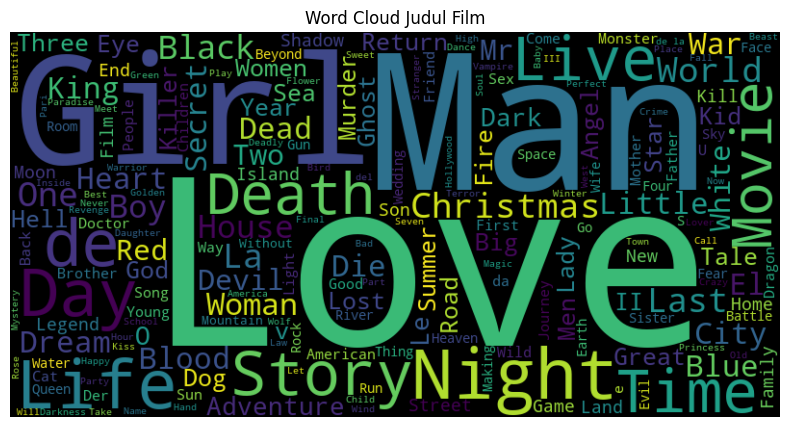

---
## Project Overview
Letterboxd adalah platform sosial yang memungkinkan pengguna untuk mencatat, menilai, dan berbagi film yang mereka tonton. Pengguna dapat membuat daftar film, menemukan film baru, berinteraksi dengan penggemar film lainnya, dan terlibat dalam komunitas film. Sistem rekomendasi penting dalam Letterboxd karena membantu pengguna menemukan film baru berdasarkan minat mereka, meningkatkan pengalaman pengguna, mendorong interaksi dan partisipasi dalam komunitas, memperluas pengetahuan pengguna tentang genre atau sutradara baru, dan meningkatkan keterlibatan pengguna dalam platform. Sistem rekomendasi menjadi penting sebagai alat untuk menyaring informasi dan menyajikan item berdasarkan preferensi dan perilaku pengguna[[1]](#daftar-pustaka). Implementasi sistem rekomendasi sangat penting untuk platform Letterboxd. Dengan sistem rekomendasi, pengguna dapat menemukan film-film baru yang sesuai dengan minat mereka, mengatasi masalah kelebihan informasi, dan meningkatkan pengalaman pengguna dalam mencari dan menonton film. Sistem rekomendasi juga dapat mendorong interaksi dan partisipasi pengguna dalam komunitas film di Letterboxd serta membantu pengguna mengeksplorasi genre atau sutradara baru. Dengan demikian, implementasi sistem rekomendasi dapat meningkatkan nilai tambah dan daya tarik platform Letterboxd bagi pengguna yang gemar film.

---
## Business Understanding
*Business Understanding* adalah pemahaman tentang kepentingan dan manfaat bisnis dari implementasi sistem rekomendasi dalam platform Letterboxd. Dengan sistem rekomendasi, Letterboxd dapat meningkatkan pengalaman pengguna, menarik pengguna baru, dan memperkuat posisi bisnisnya di pasar hiburan. Sistem rekomendasi membantu pengguna menemukan film yang sesuai dengan minat mereka, memperluas pengetahuan pengguna tentang film, dan mendorong interaksi dan partisipasi dalam komunitas film di Letterboxd. Hal ini berpotensi meningkatkan kepuasan pengguna, pertumbuhan pengguna aktif, dan keuntungan bisnis bagi Letterboxd.

### Problem Statements :
1. Bagaimana Letterboxd dapat membantu pengguna menemukan film yang sesuai dengan minat mereka di tengah katalog film yang luas dan berlimpah informasi?
2. Bagaimana Letterboxd dapat meningkatkan rekomendasi yang ada agar pengguna dapat lebih mudah mengeksplorasi berbagai genre film?

### Goals :
1. Membantu pengguna Letterboxd menemukan film yang sesuai dengan minat mereka secara efektif di dalam katalog film yang luas dan berlimpah informasi.
2. Meningkatkan sistem rekomendasi Letterboxd untuk memungkinkan pengguna mengeksplorasi genre film dengan lebih mudah dan mendapatkan rekomendasi yang relevan.

### Solution Approach :
1. Content-Based Filtering: Menggunakan metode ini, kita dapat menganalisis preferensi pengguna berdasarkan atribut film seperti genre. Rekomendasi akan disajikan berdasarkan kesamaan atribut antara film yang telah ditonton oleh pengguna dan film-film lainnya dalam database Letterboxd.
2. Collaborative Filtering: Metode ini akan menganalisis perilaku pengguna secara kolektif dengan mempertimbangkan preferensi pengguna lain yang memiliki minat serupa. Rekomendasi akan disajikan berdasarkan kesamaan pola penilaian dan penggunaan film antara pengguna yang memiliki preferensi serupa.

Dengan mengimplementasikan kedua pendekatan tersebut, Letterboxd dapat menyediakan rekomendasi film yang lebih personal dan akurat kepada pengguna, memungkinkan mereka untuk menemukan film-film baru yang menarik, serta meningkatkan interaksi dan partisipasi dalam komunitas film.

---
## Data Understanding
*Dataset* yang digunakan dalam proyek ini merupakan data yang dapat diunduh di: [Kaggle Dataset](https://www.kaggle.com/datasets/samlearner/letterboxd-movie-ratings-data). Letterboxd Movie Ratings Data merupakan data hasil scraping yang dilakukan oleh salah satu pengguna platform kaggle terhadap situs [Letterboxd](https://letterboxd.com/).

#### **Infomasi Dataset :**

Berikut merupakan informasi mengenai data yang digunakan:

Variabel pertama merupakan variabel *Movie*, penjelasan terkait variabel tersebut akan di visualisaikan pada Tabel 1.

Tabel 1. Informasi Variabel *Movie*

| No | Nama Variabel | Deskripsi | Tipe Data |
|---|---|---|---|
| 0 | _id | Id unik global. | object |
| 1 | genres | Genre film terkait. | object |
| 2 | image_url | Gambar yang digunakan di situs Letterboxd untuk film tersebut. | object |
| 3 | imdb_id | Id IMDB. | object |
| 4 | imdb_link | Tautan ke halaman IMDB. | object |
| 5 | movie_id | Id Film. | object |
| 6 | movie_title | Judul Film. | object |
| 7 | original_language | Bahasa asli film. | object |
| 8 | overview | Deskprisi film. | object |
| 9 | popularity | Popularitas film. | float64 |
| 10 | production_countries | Negara produksi film. | object |
| 11 | release_date | Tanggal liris. | object |
| 12 | runtime | Waktu proses dalam hitungan menit. | float64 |
| 13 | spoken_languages | Bahasa lisan dalam film. | object |
| 14 | tmdb_id | Id TMDB | float64 |
| 15 | tmdb_link | Tautan ke halaman TMDB | object |
| 16 | vote_average | Rata - rata perhitungan suara(Vote). | float64 |
| 17 | vote_count | Perhitungan suara(Vote). | float64 |
| 18 | year_released | Tahun rilis. | float64 |

 

Variabel kedua merupakan variabel *Rating*, penjelasan terkait variabel tersebut akan di visualisaikan pada Tabel 2.

Tabel 2. Informasi Variabel *Rating*

| No | Nama Variabel | Deskripsi | Tipe Data |
|---|---|---|---|
| 0 | _id | Id unik global. | object |
| 1 | movie_id | Id Film. | object |
| 2 | rating_val | Penilaian peringkat terhadap film/ | int64 |
| 3 | user_id | Id Pengguna. | object |

 

Variabel ketiga merupakan variabel *User*, penjelasan terkait variabel tersebut akan di visualisaikan pada Tabel 3.

Tabel 3. Informasi Variabel *User*

| No | Nama Variabel | Deskripsi | Tipe Data |
|---|---|---|---|
| 0 | _id | Id unik global. | object |
| 1 | display_name | Nama pengguna. | object |
| 2 | num_ratings_pages | Jumlah halaman pengguna dalam memberikan peringkat. | float64 |
| 3 | num_reviews | Jumlah total ulasan penggunna terhadap film. | int64 |
| 4 | username | Id Pengguna, | object |

 

### **Exploratory Data Analysis (EDA)**

#### **Data Explorations**

Supaya dapat lebih memahami karakter serta wawasan yang terdapat didalam masing - masing variabel, kita perlu melakukan explorasi pada masing - masing variabel tersebut.

- **Movie**

    Mengingat data didapatkan dari proses *scraping*, maka tidak semua fitur akan dimanfaatkan. Sehingga pada variabel *movie* akan diambil fitur-fitur yang dirasa berguna saja. Tabel 4 merupakan visualisasi daripada variabel *movie* setelah dilakukan penghapusan beberapa fitur.

    Tabel 4. Visualisasi Variabel *Movie*

    | movie_id | movie_title | genres | original_language | spoken_languages | production_countries | year_released | popularity |  |
    |---:|---:|---:|---:|---:|---:|---:|---:|---|
    | 0 | football-freaks | Football Freaks | ["Music","Animation"] | en | [] | ["United Kingdom"] | 1971.0 | 0.600 |
    | 1 | aftermath-1960 | Aftermath | [] | en | [] | [] | 1960.0 | 0.600 |
    | 2 | where-chimneys-are-seen | Where Chimneys Are Seen | ["Drama"] | ja | ["日本語"] | ["Japan"] | 1953.0 | 1.568 |
    | 3 | the-musicians-daughter | The Musician's Daughter | ["Drama"] | en | [] | ["United States of America"] | 1911.0 | 0.600 |
    | 4 | 50-years-of-fabulous | 50 Years of Fabulous | ["Documentary"] | en | [] | [] | 2018.0 | 0.600 |
    | ... | ... | ... | ... | ... | ... | ... | ... | ... |
    | 285958 | the-western-world-of-sailor-moon | NaN | NaN | NaN | NaN | NaN | NaN | NaN |
    | 285959 | shadowplay | NaN | NaN | NaN | NaN | NaN | NaN | NaN |
    | 285960 | only-always-you | NaN | NaN | NaN | NaN | NaN | NaN | NaN |
    | 285961 | one-night-stand-ellen-degeneres | NaN | NaN | NaN | NaN | NaN | NaN | NaN |
    | 285962 | the-french-democracy | NaN | NaN | NaN | NaN | NaN | NaN | NaN |
    | 285963 rows × 8 columns |

    Dari hasil visualisai tersebut, terdapat nilai yang perlu dinormalisasikan dari beberapa fitur yang tersedia pada variable *movie*. Normalisasi nilai dilakukan dengan cara menghapus simbol-simbol seperti `[]` dan `"`, juga dilakukan proses penghapusan data yang hilang. Hasil dari normalisasi dan penanganan nilai yang hilang tersebut dapat dilihat pada tabel 5.

    Tabel 5. Normalisasi nilai fitur pada Variabel *Movie*

    | movie_id | movie_title | genres | original_language | spoken_languages | production_countries | year_released | popularity |  |
    |---:|---:|---:|---:|---:|---:|---:|---:|---|
    | 0 | where-chimneys-are-seen | Where Chimneys Are Seen | Drama | ja | 日本語 | Japan | 1953.0 | 1.568 |
    | 1 | where-love-has-gone | Where Love Has Gone | Romance | en | English | United States of America | 1964.0 | 2.304 |
    | 2 | sharing-the-secret | Sharing the Secret | Drama | en | English | United States of America | 2000.0 | 3.531 |
    | 3 | blood-scarab | Blood Scarab | Horror | en | English | United States of America | 2008.0 | 3.553 |
    | 4 | the-christine-jorgensen-story | The Christine Jorgensen Story | Drama | en | English | United States of America | 1970.0 | 1.708 |
    | ... | ... | ... | ... | ... | ... | ... | ... | ... |
    | 170831 | my-daughters-double-life-2021 | My Daughter's Double Life | Thriller,TV Movie | en | English | United States of America | 2021.0 | 2.814 |
    | 170832 | brave-gunjo-senki | Brave: Gunjō senki | Action,History | ja | 日本語 | Japan | 2021.0 | 4.678 |
    | 170833 | ignore-it | Ignore It | Horror | en | English | United States of America | 2021.0 | 0.6 |
    | 170834 | frederick-douglass-in-five-speeches | Frederick Douglass: In Five Speeches | Documentary,History | en | English | United States of America | 2022.0 | 6.003 |
    | 170835 | the-great-sketch-experiment | The Great Sketch Experiment | Comedy | en | English | United States of America | 2006.0 | 0.6 |
    | 170836 rows × 8 columns |

     

    

    Gambar 1. Word Cloud Judul Film

    *Word Cloud* adalah visualisasi kata-kata yang sering muncul dalam teks atau dataset. Ukuran kata menunjukkan frekuensi kemunculannya. *Word Cloud* membantu mengidentifikasi kata-kata kunci dan tema yang dominan dalam teks dengan cara yang mudah dipahami secara visual. Dari judul film yang dianalisis, kata-kata "Love", "Man", dan "Girl" memiliki frekuensi kemunculan yang tinggi. Hal ini menunjukkan bahwa judul film cinta dan hubungan antara pria dan wanita mungkin menjadi judul film dominan dalam dataset judul film tersebut yang dapat dilihat pada gambar 1.

 

- **Rating**

    Pemilihan fitur yang akan digunakan juga dilakukan pada variabel *rating*, termasuk dalam menangani masalah data yang hilang. Sebagai gambaran mengenai data-data yang terdapat pada variabel *rating*, dapat dilihat padan tabel 6.

    Tabel 6. Visualisasi Variabel *Rating*

    |  | movie_id | rating_val | user_id |
    |---:|---:|---:|---|
    | 0 | feast-2014 | 7 | deathproof |
    | 1 | loving-2016 | 7 | deathproof |
    | 2 | scripted-content | 7 | deathproof |
    | 3 | the-future | 4 | deathproof |
    | 4 | mank | 5 | deathproof |
    | ... | ... | ... | ... |
    | 11078162 | alien-3 | 6 | turnitip |
    | 11078163 | battleship-potemkin | 7 | turnitip |
    | 11078164 | pusher | 6 | turnitip |
    | 11078165 | wild-strawberries | 7 | turnitip |
    | 11078166 | x-2022 | 5 | turnitip |
    | 11078167 rows × 3 columns |

     

    

    Gambar 2. Distribusi Rating Film

    Pada gambar 2, rating 8 secara signifikan lebih unggul dibandingkan dengan rating lainnya dalam dataset, dengan jumlah film mencapai 2.174.517. Keunggulan rating 8 mencerminkan kualitas yang sangat baik dan tingginya apresiasi pengguna terhadap film-film tersebut. Film-film dengan rating 8 menawarkan pengalaman luar biasa dan menjadi rekomendasi menarik untuk dieksplorasi.

 

- **User**

    Pada tabel 7 yaitu visualisasi sebagian data dari variabel *user*, merupakan data mengenai pengguna yang termasuk didalamnya berupa informasi jumlah ulasan yang diberikan oleh pongguna tersebut. Berikut visualisasinya :

    Tabel 7. Visualisasi Variabel *User*

    |  | _id | display_name | num_ratings_pages | num_reviews | username |
    |---:|---:|---:|---:|---:|---|
    | 0 | 5fc4172ec6cd28ebd99dd0e2 | Lucy | 32.0 | 1650 | deathproof |
    | 1 | 5fc4172ec6cd28ebd99dd0ea | Matt Singer | 52.0 | 1915 | superpulse |
    | 2 | 5fc4172ec6cd28ebd99dd0ed | Sean Baker | 21.0 | 1283 | lilfilm |
    | 3 | 5fc4172ec6cd28ebd99dd0ee | iana | 37.0 | 1177 | ianamurray |
    | 4 | 5fc419171ebf67b9fbe48615 | Lizzy | 57.0 | 1810 | punchdrunklizzy |
    | ... | ... | ... | ... | ... | ... |
    | 8134 | 6239b430a936b956009c993c | Máté Turi-Mészáros | NaN | 237 | mateazember |
    | 8135 | 6239cbf7a936b95600a2d24c | Finn | NaN | 297 | finnvor1 |
    | 8136 | 6239d254a936b95600a4472f | Daniel | NaN | 1231 | daniel |
    | 8137 | 6239df37a936b95600aa7aa5 | ButterflyFilms | NaN | 800 | butterflyfilms |
    | 8138 | 6239e55ba936b95600ae2012 | Flo | NaN | 1901 | poellnerson |
    | 8139 rows × 5 columns |

 

#### **Data Preprocessing**

Penggabungan data merupakan tahap dalam data preprocessing di mana dua atau lebih dataset digabungkan menjadi satu dataset yang lebih lengkap. Tujuan penggabungan data adalah mengintegrasikan informasi yang relevan dari berbagai sumber data. Proses ini melibatkan pencocokan dan penggabungan baris atau kolom berdasarkan kunci atau atribut yang sama antara dataset yang berbeda. Penggabungan data dilakukan untuk mempersiapkan data sebelum melanjutkan ke tahap selanjutnya, seperti pembersihan atau pemodelan data.

Variable *movie* dan *rating* akan digabungkan menjadi dataframe baru dengan nama variabel *dataset*, berikut hasil penggabungan data yang dapat dilihat pada tabel 8.

Tabel 8. Visualisasi Variabel *Dataset*

|   | user_id | rating_val | movie_id | movie_title | genres | original_language | spoken_languages | production_countries | year_released | popularity |
|---:|---:|---:|---:|---:|---:|---:|---:|---:|---:|---|
| 0 | deathproof | 7 | feast-2014 | Feast | Animation,Comedy,Drama,Family | en | English | United States of America | 2014.0 | 9.26 |
| 1 | deathproof | 7 | loving-2016 | Loving | Romance,Drama | en | English | United Kingdom,United States of America | 2016.0 | 18.024 |
| 2 | deathproof | 7 | scripted-content | NaN | NaN | NaN | NaN | NaN | NaN | NaN |
| 3 | deathproof | 4 | the-future | The Future | Drama,Fantasy,Romance | en | English | Germany,United States of America,France,United... | 2011.0 | 5.208 |
| 4 | deathproof | 5 | mank | Mank | Drama,History | en | English | United States of America | 2020.0 | 16.331 |
| ... | ... | ... | ... | ... | ... | ... | ... | ... | ... | ... |
| 11078156 | turnitip | 6 | alien-3 | Alien³ | Science Fiction,Action,Horror | en | English | United Kingdom,United States of America | 1992.0 | 22.524 |
| 11078157 | turnitip | 7 | battleship-potemkin | Battleship Potemkin | Drama,History | ru | No Language | Soviet Union | 1925.0 | 8.771 |
| 11078158 | turnitip | 6 | pusher | Pusher | Action,Crime,Drama,Thriller | da | Dansk,Srpski,svenska | Denmark | 1996.0 | 6.615 |
| 11078159 | turnitip | 7 | wild-strawberries | Wild Strawberries | Drama | sv | Latin,svenska | Sweden | 1957.0 | 13.574 |
| 11078160 | turnitip | 5 | x-2022 | X | Horror,Mystery,Thriller | en | English | United States of America | 2022.0 | 99.026 |
| 11078161 rows × 10 columns |

 

---

## Data Preparation
Beberapa teknik yang dilakukan pada tahap persiapan data yaitu :

- Penggabungan data (*Data Integration*): Menggabungkan beberapa dataset yang memiliki variabel yang saling terkait untuk memperkaya informasi dan memungkinkan analisis lintas variabel.

- Pembersihan data (*Data Cleaning*): Mengidentifikasi dan menangani *missing values* (nilai yang hilang), dan duplikasi dalam dataset. Penanganan *missing value* dan data duplikat penting karena mereka dapat mempengaruhi hasil analisis dan pemodelan. *Missing value* dapat menyebabkan bias dan kesalahan dalam perhitungan statistik, serta mengganggu algoritma pembelajaran mesin. Data duplikat dapat menghasilkan hasil yang bias, mengganggu performa model, dan menyebabkan pemborosan sumber daya. Oleh karena itu, penanganan yang tepat diperlukan untuk menjaga integritas dan kualitas data, serta mencegah kesalahan dan bias dalam analisis.

- Transformasi data: Melakukan transformasi data seperti normalisasi untuk mengubah data menjadi format yang lebih sesuai untuk analisis atau pemodelan. Terdapat simbol `[]` dan `"` yang terkandung didalam beberapa fitur sehingga perlu dihilangkan atau dihapus.

- Pengurangan jumlah sampel: dikarenakan daya komputasi yang terbatas, maka dilakukan pengurangan jumlah sampel supaya proses *training* model dapat berjalan tanpa gangguan. Pada prosesnya, infrastruktur yang digunakan adalah perangkat pribadi (laptop) dan mengalami masalah *kernel crash*. Dilakukan eksperimen dengan mengeksekusi program dilingkungan **Google Colab** dan **Kaggle** namun hasilnnya tetap sama yaitu mengalami *error* (*kernel crash*). Setelah dilakukan pengurangan jumlah sampel, program berjalan dengan baik. Teknik pengambilan sampel yang digunakan yaitu dengan *Simple Random Sampling*.

---

## Modeling and Result

Pemodelan adalah proses membangun representasi matematika atau statistik dari data untuk menjawab tujuan atau pertanyaan yang diinginkan. Pemodelan membantu kita mendapatkan wawasan dari data dan membuat keputusan yang lebih baik. Dua pendekatan algoritma dalam proyek sistem rekomendasi film ini yaitu *Content Based Filtering* dan *Collaborative Filtering*.

1. *Content Based Filtering*

   Sistem rekomendasi berbasis *Content based Filtering* mengoperasikan dengan cara membandingkan fitur-fitur dari item yang tersedia di dalam sistem dengan preferensi dan profil pengguna untuk memberikan rekomendasi yang sesuai dengan minat pengguna[[2]](#daftar-pustaka). Algoritma ini bekerja dengan mengidentifikasi fitur atau atribut dari item dan membandingkannya dengan preferensi pengguna untuk memberikan rekomendasi yang relevan. Langkah-langkahnya meliputi pengumpulan data, pembentukan profil pengguna, ekstraksi fitur, perhitungan kesamaan, dan peringkat serta rekomendasi item. Algoritma ini mencari item yang memiliki atribut yang serupa atau mirip dengan preferensi pengguna, dan menghasilkan rekomendasi berdasarkan tingkat kesamaan tersebut.

    - Kelebihan *Content Based Filtering*[[3]](#daftar-pustaka):
        - *User independent* sehingga tidak mengalami sparse problem.
        - Tidak mengalami *cold start* problem untuk item baru.

    - Kekurangan *Content Based Filtering*[[3]](#daftar-pustaka):
        - Masalah *cold start* untuk pengguna baru.
        - Masalah *over specialization* atau pengguna terbatas mendapatkan rekomendasi yang mirip dengan yang sudah dikenal dalam profilnya.

    Berikut merupakan top-N recommendation untuk id film `lover-divine` yang bergenre `Drama,Music,Romance` dengan pendekatan *Content Based Filtering* yang dapat dilihat pada tabel 9.

    Tabel 9. top-10 recommendation *Content Based Filtering*

    |   | movie_id | genres |
    |---:|---:|---:|
    | 0 | daddy-long-legs | Drama,Music,Romance |
    | 1 | la-boheme-1988 | Music,Drama,Romance |
    | 2 | high-strung-2016 | Drama,Music,Romance |
    | 3 | 99-songs | Music,Drama,Romance |
    | 4 | the-dust-storm | Romance,Drama,Music |
    | 5 | devdas-1955 | Music,Drama,Romance |
    | 6 | liefling | Romance,Drama,Music |
    | 7 | porgy-and-bess | Music,Drama,Romance |
    | 8 | new-moon-1930 | Drama,Romance,Music |
    | 9 | farewell-restaurant-2020 | Drama,Romance,Music |

2. *Collaborative Filtering*

    Sistem rekomendasi menggunakan pendekatan *collaborative filtering* (CF) bekerja dengan menggabungkan preferensi pengguna dalam bentuk penilaian terhadap item-item, dan kemudian memanfaatkan kesamaan pola perilaku antar pengguna untuk memprediksi penilaian dan menentukan rekomendasi item yang sesuai[[3]](#daftar-pustaka). Cara kerja algoritma Collaborative Filtering didasarkan pada asumsi bahwa pengguna dengan preferensi serupa cenderung menyukai item yang sama. Algoritma ini mencari kesamaan antara pengguna berdasarkan riwayat penilaian atau perilaku mereka, dan menggunakan informasi tersebut untuk menghasilkan rekomendasi yang personal. *Collaborative Filtering* adalah metode rekomendasi yang melibatkan langkah-langkah berikut. Pertama, data pengguna dan preferensi mereka terhadap item dikumpulkan. Selanjutnya, algoritma mengidentifikasi pengguna-pengguna dengan preferensi serupa menggunakan metrik kesamaan. Berdasarkan kesamaan ini, model kolaboratif dibentuk. Dalam langkah terakhir, item yang disukai oleh pengguna serupa diberi peringkat dan direkomendasikan kepada pengguna lain.

    - Kelebihan *Collaborative Filtering* Regressor[[3]](#daftar-pustaka):
        - Hasil rekomendasi yang beragam dan bersifat *serendipitous* (relevan dan baru).

    - Kekurangan *Collaborative Filtering* Regressor[[3]](#daftar-pustaka):
        - Masalah *cold start* (tidak dapat menghasilkan rekomendasi dikarenakan tidak adanya informasi preferensi) untuk pengguna baru dan item baru.
        - *Sparse problem* (matriks rating pengguna-item yang jarang/banyak yang kosong dapat mempengaruhi keakuratan algoritma).

     

    Hasil daripada pendekatan *Collaborative Filtering* dapat dilihat pada tabel 10. Tabel 10 merupakan top-N rekomendasi film untuk pengguna `deathproof`. Film-film yang direkomendasikan memiliki berbagai genre seperti Horror, Science Fiction, Drama, Action, History, War, Fantasy, Comedy, Western, Adventure, Romance, Animation, Family, dan Drama. Dalam rekomendasi ini, rating prediksi untuk setiap film adalah 6.51. Rekomendasi ini disusun menggunakan metode *Collaborative Filtering* yang menganalisis preferensi dan perilaku pengguna serta membandingkannya dengan pengguna lain. Tujuan dari rekomendasi ini adalah memberikan pengalaman menonton yang lebih personal dan sesuai dengan minat pengguna dalam hal ini pengguna adalah `deathproof`, sehingga pengguna dapat menemukan film-film yang mungkin mereka sukai berdasarkan kesamaan preferensi dengan pengguna lain. :

    Tabel 10. top-10 recommendation *Collaborative Filtering* untuk pengguna deathproof

    |   | Movie | Genres | Rating |
    |---|---:|---:|---:|
    | 0 | zygote | Horror,Science Fiction | 6.506437004370439 |
    | 1 | zuzu-angel | Drama | 6.506437004370439 |
    | 2 | zulu | Action,Drama,History,War | 6.506437004370439 |
    | 3 | zu-warriors | Fantasy,Action | 6.506437004370439 |
    | 4 | zotz | Comedy,Fantasy | 6.506437004370439 |
    | 5 | zorro-the-gay-blade | Western,Action,Comedy,Adventure,Romance,History | 6.506437004370439 |
    | 6 | zootopia | Animation,Adventure,Family,Comedy | 6.506437004370439 |
    | 7 | zoombie | Comedy | 6.506437004370439 |
    | 8 | zoom-and-bored | Animation | 6.506437004370439 |
    | 9 | zoom-2015 | Animation,Comedy,Drama | 6.506437004370439 |

---

## Evaluation

Evaluasi dalam pemodelan atau machine learning merupakan proses untuk menilai kinerja suatu model atau algoritma berdasarkan data yang telah dikumpulkan atau diuji. Tujuannya adalah mengukur sejauh mana model mampu melakukan prediksi atau penyesuaian terhadap data baru yang belum terlihat sebelumnya.

- Precision:

    Precision adalah metrik evaluasi yang digunakan untuk mengukur sejauh mana model rekomendasi dapat memberikan rekomendasi yang tepat. Metrik ini menghitung persentase rekomendasi yang relevan dari total rekomendasi yang diberikan oleh model. Semakin tinggi nilai precision, semakin baik kinerja model dalam memberikan rekomendasi yang sesuai dengan preferensi pengguna.

    Precision = $\frac{\text{True Positive}}{\text{True Positive} + \text{False Positive}}$

    Di mana *True Positive* adalah jumlah prediksi yang benar positif (item yang direkomendasikan dan memang relevan). Sedangkan *False Positive* adalah jumlah prediksi yang salah positif (item yang direkomendasikan tetapi tidak relevan).

- Root Mean Squared Error (RMSE):

    RMSE (Root Mean Squared Error) adalah metrik evaluasi yang digunakan untuk mengukur sejauh mana perbedaan antara nilai prediksi dan nilai sebenarnya dalam model. RMSE dihitung dengan mengambil akar kuadrat dari rata-rata dari selisih kuadrat antara nilai prediksi dan nilai sebenarnya. Semakin rendah nilai RMSE, semakin akurat model dalam memprediksi nilai yang sebenarnya.

    RMSE = $\sqrt{\frac{1}{n} \sum_{i=1}^{n} (y_i - \hat{y}_i)^2}$

    Di mana $y_i$ adalah nilai sebenarnya dari observasi ke-${{i}}$, $\hat{y}_i$ adalah nilai yang diprediksi oleh model untuk observasi ke-${{i}}$. ${{n}}$ adalah jumlah total observasi.

- Mean Absolute Error (MAE):
    
    MAE (Mean Absolute Error) adalah metrik evaluasi yang digunakan untuk mengukur kinerja model dalam memprediksi nilai secara absolut. MAE mengukur selisih rata-rata antara nilai yang diprediksi oleh model (y^) dengan nilai sebenarnya (y) dalam dataset. Semakin rendah nilai MAE, semakin baik kinerja model.

    MAE = $(1/n) * Σ|yi - ŷi|$

    Dimana ${{n}}$ adalah jumlah data yang dievaluasi, $y_i$ adalah nilai sebenarnya dari data ke-${{i}}$, $\hat{y}_i$ adalah nilai yang diprediksi oleh model untuk data ke-${{i}}$.

Dalam proyek ini, terdapat tiga metrik evaluasi yang digunakan untuk kedua metode rekomendasi, precision untuk *Content Based Filtering* serta metrik rmse dan mae untuk *Collaborative Filtering*. 

Untuk metode *Content Based Filtering*, metrik evaluasi precision mencapai 100%. Hal ini menunjukkan bahwa semua rekomendasi yang dibuat oleh metode tersebut sesuai dengan preferensi pengguna. Metode *Content Based Filtering* berhasil memberikan rekomendasi yang tepat berdasarkan fitur-fitur item dan profil pengguna.

Sementara itu, metrik evaluasi RMSE (*Root Mean Square Error*) untuk metode *Collaborative Filtering* menunjukkan nilai sebesar 2.0532. Nilai RMSE yang relatif rendah mengindikasikan bahwa metode *Collaborative Filtering* memiliki tingkat kesalahan yang kecil dalam memprediksi peringkat atau preferensi pengguna terhadap item.

Selanjutnya, metrik evaluasi MAE (Mean Absolute Error) untuk metode *Collaborative Filtering* menghasilkan nilai sebesar 1.6419. Nilai MAE yang rendah menunjukkan bahwa metode *Collaborative Filtering* memberikan prediksi yang cukup akurat dan memiliki tingkat kesalahan yang kecil dalam memperkirakan peringkat item oleh pengguna.

Dengan demikian, hasil proyek menunjukkan bahwa metode *Content Based Filtering* berhasil memberikan rekomendasi dengan tingkat presisi yang sempurna (100%), sementara metode *Collaborative Filtering* memiliki nilai RMSE dan MAE yang relatif rendah, menunjukkan kinerja yang baik dalam memprediksi preferensi pengguna terhadap item.
 

---
## Conclusion

Berdasarkan hasil proyek dan metrik evaluasi yang diberikan, berikut adalah kesimpulan yang dapat diambil:

1. *Content Based Filtering*:
   - Model *Content Based Filtering* mencapai tingkat presisi 100%, artinya rekomendasi yang diberikan secara keseluruhan sangat sesuai dengan preferensi pengguna. Untuk menghitung tingkat presisi, kita mengacu pada tabel 9 yang menampilkan 10 rekomendasi film dengan genre Drama, Music, dan Romance. Dalam tabel tersebut, dapat dilihat bahwa setiap rekomendasi film memiliki genre yang sesuai dengan minat film dari id film `lover-divine`. Dengan demikian, semua 10 rekomendasi film tersebut memiliki tingkat presisi yang tinggi, karena mereka sesuai dengan preferensi genre dari pengguna tersebut. Supaya lebih dapat mudah dipahami, perhitungan akan dilakukan pada persamaan berikut:
   
        Precision = $\frac{\text{True Positive}}{\text{True Positive} + \text{False Positive}}$ = $\frac{\text{10}}{\text{10} + \text{0}}$ = 1 = 100%

   - Informasi yang digunakan dalam model ini adalah fitur-fitur pada item dan profil pengguna.
   - *Content Based Filtering* memiliki kelebihan yaitu user independent sehingga tidak mengalami sparse problem, dan juga tidak mengalami cold start problem untuk item baru.
   - Namun, kelemahan dari *Content Based Filtering* adalah masalah *cold start* untuk pengguna baru, serta masalah *over specialization* di mana pengguna terbatas dalam mendapatkan rekomendasi yang mirip dengan yang sudah dikenal dalam profilnya.

     
2. *Collaborative Filtering*:
   - Model *Collaborative Filtering* memiliki nilai RMSE sebesar 2.0532 dan MAE sebesar 1.6419, yang menunjukkan tingkat kesalahan yang relatif rendah dalam prediksi rating item.
   - Metode ini memanfaatkan kesamaan perilaku antar pengguna untuk memberikan rekomendasi.
   - Kelebihan dari *Collaborative Filtering* adalah menghasilkan rekomendasi yang beragam dan bersifat *serendipitous*, yaitu rekomendasi yang tidak hanya relevan dengan preferensi pengguna, tetapi juga menawarkan konten baru yang belum dikenal sebelumnya.
   - Namun, kelemahan *Collaborative Filtering* adalah adanya masalah *cold start* untuk pengguna baru dan item baru, di mana algoritma tidak dapat menghasilkan rekomendasi karena tidak ada informasi preferensi yang tersedia. Selain itu, *sparse problem* juga menjadi masalah, di mana keakuratan algoritma dapat terpengaruh oleh matriks rating pengguna-item yang memiliki banyak nilai kosong atau jarang terisi.

Secara keseluruhan, kedua metode rekomendasi yaitu *Content Based Filtering* dan *Collaborative Filtering* memberikan hasil yang baik dalam memberikan rekomendasi kepada pengguna. *Content Based Filtering* memiliki tingkat presisi yang sempurna, sedangkan *Collaborative Filtering* memiliki tingkat kesalahan yang relatif rendah. Pilihan metode tergantung pada konteks dan tujuan aplikasi, serta mempertimbangkan keterbatasan dan kelebihan masing-masing metode.

---

### Daftar Pustaka :

[1]	S. C. Aishwvarya, “Optimasi model sistem rekomendasi film dengan neural network (studi kasus: Platform letterboxd),” 2022.

[2]	D. A. Pratondo, “Pengembangan Sistem Rekomendasi Berbasis Content-Based Filtering Pada data Dinamis,” 2023.

[3]	H. H. Arfisko and A. T. Wibowo, “Sistem Rekomendasi Film Menggunakan Metode Hybrid Collaborative Filtering Dan Content-Based Filtering,” e-Proceeding of Engineering, vol. 9, no. 3, p. 2149, 2022.